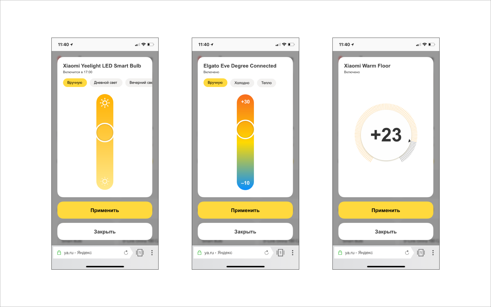

---

layout: yandex2

style: |
    /* собственные стили можно писать здесь!! */
    .img1 { margin: -60px auto 0; display: block; }


---

# {:.logo}

## {{ site.presentation.title }}
{:.title}

### {{ site.presentation.service }}



{:.nda}


<div class="authors">

<p>{{ site.author.name }}, {{ site.author.position }}</p>



<p>{{ site.author2.name }}, {{ site.author2.position }}</p>


</div>

## Задание 1:<br />найди ошибки
{:.section}

## Задание


{:.image-right}

**Исправить ошибки в приложении, которое отображает данные на карте.**

Приложение использует:

- [API Яндекс Карт](https://tech.yandex.ru/maps/)
- [Chart.js](www.chartjs.org)
- [Webpack](https://webpack.js.org)

## Ошибки
{:.section}

## Приложение не запускается

```

WARNING in ./src/index.js 4:2-9
"export 'default' (imported as 'initMap') was not found in './map'
```

## Приложение не запускается

```

WARNING in ./src/index.js 4:2-9
"export 'default' (imported as 'initMap') was not found in './map'
```
<br/>/src/index.js

```js
// было
import initMap from "./map";

// стало
import {initMap} from "./map";
```
## Не отображается карта

{:.img1}

## Не отображается карта

/public/index.css

```css
#map {
  height: 100%;
}
```

## Структура проекта

```
├─ public
│   ├─ index.css
│   └─ index.html
├─ src
│   ├─ api.js
│   ├─ chart.js
│   ├─ details.js
│   ├─ filter.js
│   ├─ index.js
│   ├─ map.js
│   ├─ mappers.js
│   └─ popup.js
│  ...
```

## Не отображаются метки

{:.img1}

## Не отображаются метки

{:.img1}

## Не отображаются метки

/src/map.js

```js
const objectManager = new ymaps.ObjectManager({
    // ...
});

loadList().then(data => {
    objectManager.add(data);
});
```

## Не отображаются метки

/src/map.js

```js
const objectManager = new ymaps.ObjectManager({
    // ...
});

loadList().then(data => {
    objectManager.add(data);
    
    // добавляем objectManager на карту
    myMap.geoObjects.add(objectManager);
});
```

### [https://tech.yandex.ru/maps/doc/jsapi/2.1/ref/reference/ObjectManager-docpage](https://tech.yandex.ru/maps/doc/jsapi/2.1/ref/reference/ObjectManager-docpage/)

## Метки не в Москве

{:.img1}

## Метки не в Москве

{:.img1}

### [https://tech.yandex.ru/maps/doc/jsapi/2.1/dg/concepts/geoobjects-docpage](https://tech.yandex.ru/maps/doc/jsapi/2.1/dg/concepts/geoobjects-docpage/)

## Неправильный маркер

{:.img1}

## Неправильный маркер

/src/map.js

```js
const objectManager = new ymaps.ObjectManager({
    clusterIconLayout: 'default#pieChart',
    // ...
});

// эту строчку нужно удалить
objectManager.clusters.options.set('preset', 'islands#greenClusterIcons');
```

### [https://tech.yandex.ru/maps/jsbox/2.1/clusterer_pie_chart](https://tech.yandex.ru/maps/jsbox/2.1/clusterer_pie_chart)

## Не открывается попап

{:.img1}

## Не открывается попап

{:.img1}

### [https://tech.yandex.ru/maps/jsbox/2.1/placemark_balloon_layout](https://tech.yandex.ru/maps/jsbox/2.1/placemark_balloon_layout)

## Не отображается график

{:.img1}

### [http://www.chartjs.org/docs/latest/axes/cartesian/linear.html#axis-range-settings](http://www.chartjs.org/docs/latest/axes/cartesian/linear.html#axis-range-settings)

## Неиспользуемый файл

{:.img1}

## Ошибки в Codestyle

<div class="next" markdown="1">
установить [eslint](https://eslint.org/docs/user-guide/getting-started)

```
$ npm install eslint --save-dev
```
</div>

<div class="next" markdown="1">
исправить codestyle

```js
{
    "scripts": {
        // ...
        "lint": "eslint --fix \"src/**/*.js\""
    }
    // ...
}
```
</div>

## Ошибки в Codestyle
{:.fullscreen}

```js
// .eslintrc

{
    "rules": {
        "indent": ["error", 4],
        "quotes": ["error", "single"],
        "no-undef": "error"
    },
    "env": { "browser": true },
    "globals": { "ymaps": true },
    "parserOptions": {
        "ecmaVersion": 6,
        "sourceType": "module",
        "ecmaFeatures": { "experimentalObjectRestSpread": true }
    }
}
```

## Вопросы?
{:.section}

## Задание 2:<br />сверстай макет
{:.section}

## Две версии макетов
{:.fullscreen}

{:.img1}

## Элементы управления
{:.fullscreen}

{:.img1}

## Кроссбраузерность
{:.fullscreen}

{:.img1}

## Как сверстать
{:.section}

## [Пример:<br/>компоновка страницы](#)
{:.shout}

## [Пример: листание](#)
{:.shout}

## [Пример: модальное окно](#)
{:.shout}

## [Пример: слайдер](#)
{:.shout}

## [Пример: крутилка](#)
{:.shout}

## Дополнительные критерии
{:.section}

## Организация и оформление кода

1. {:.next}Разбит ли код на части и насколько логично разбиение
2. {:.next}Одинаковое оформление кода

```


    $ npm install -g stylelint

    $ stylelint "foo/**/*.scss" --syntax scss
```
{:.next}

## Автоматизация

1. {:.next}autoprefixer
2. {:.next}препроцессоры
  - константы
  - циклы
  - сборка (`@import`)
3. {:.next}оптимизация (dev/prod режимы)


## NPM INSTALL
{:.fullscreen}

```


$ npm install --save-dev gulp
$ npm install --save-dev gulp-autoprefixer
$ npm install --save-dev gulp-sass
$ npm install --save-dev gulp-clean-css
```

## GULPFILE
{:.fullscreen}

```js
// gulpfile.js

const gulp = require('gulp');
const sass = require('gulp-sass');
const autoprefixer = require('gulp-autoprefixer');
const cleanCss = require('gulp-clean-css');

gulp.task('sass', function () {
  return gulp.src('./sass/**/*.scss')
    .pipe(sass())
    .pipe(autoprefixer({
      browsers: ['last 2 versions']
    }))
    .pipe(cleanCss())
    .pipe(gulp.dest('./css'));
});
```

## Вопросы?
{:.section}

## Контакты 
{:.contacts}



<figure markdown="1">

### {{ site.author.name }}


{{ site.author.position }}


</figure>





<figure markdown="1">

### {{ site.author2.name }}


{{ site.author2.position }}


</figure>



<!-- разделитель контактов -->
-------

<!-- left -->
- {:.mail}dima117a@yandex-team.ru
- {:.telegram}dima117a

<!-- right -->
- {:.github}dima117
- {:.skype}dima117a


<!-- 

- {:.mail}author@yandex-team.ru
- {:.phone}+7-999-888-7766
- {:.github}author
- {:.bitbucket}author
- {:.twitter}@author
- {:.telegram}author
- {:.skype}author
- {:.instagram}author
- {:.facebook}author
- {:.vk}@author
- {:.ok}@author

-->
